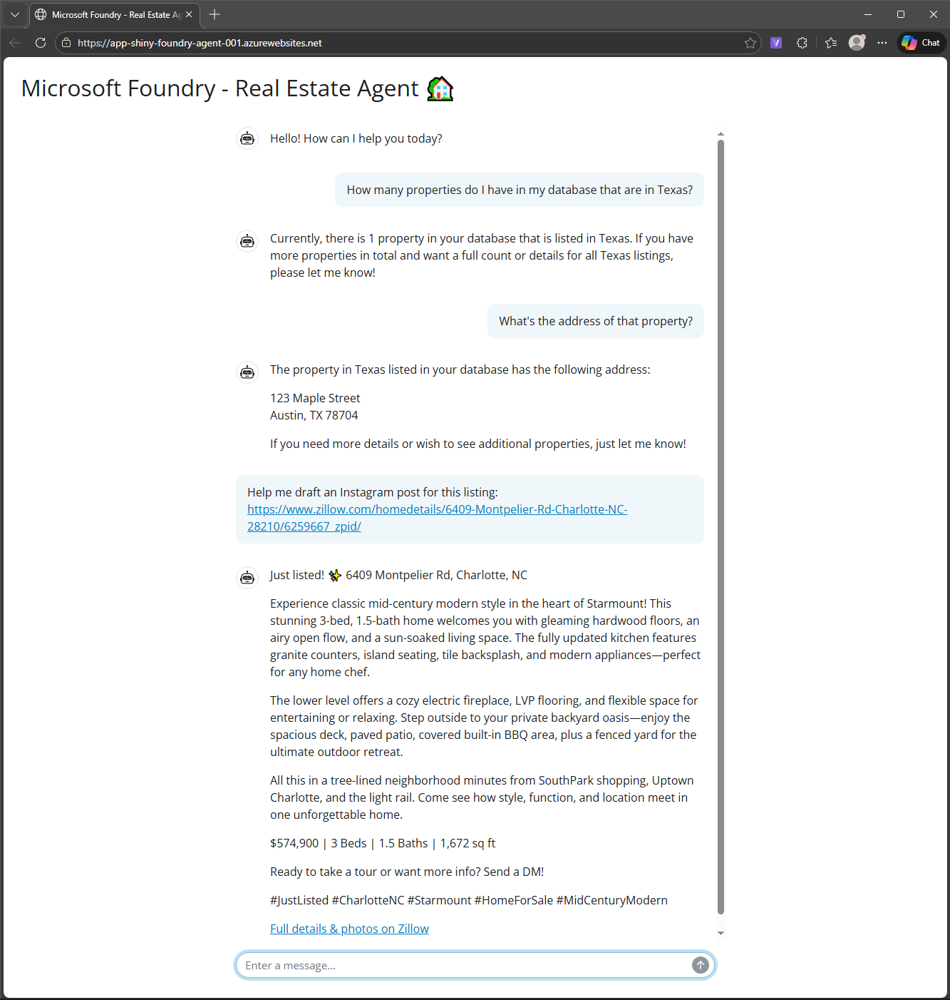

# Microsoft Foundry Agents in Shiny Apps

<h3 align="right">Colby T. Ford, Ph.D.</h3>

Logic for Deploying Custom Microsoft Foundry Agents as Shiny Python Apps in Azure




## Run the Shiny App Locally

For local testing, create a `.env` file in the `app/` directory. Then, add the endpoint for your Foundry Agent as `FOUNDRY_ENDPOINT="<URI>"`. Then you can test locally.

```bash
## Install the required Python packages
python -m pip install -r app/requirements.txt

## Start the Shiny app and launch it in the browser
python -m shiny run --reload --launch-browser app/app.py
```

This will open a browser tab that is pointing to [127.0.0.1:8000](127.0.0.1:8000). Play with the chatbot locally to make sure your Agent is responding appropriately before deploying to Azure.


## Deploy the Shiny App to Azure

This repo contains the basic Python app code and infrastructure code (in `.bicep` format) to deploy the Shiny app to an Azure App Service. The service is defined in the `infra/` directory, and the deployment is managed using the Azure Developer CLI (`azd`).

```bash
## Install the Azure Developer CLI (azd) if you haven't already
## https://aka.ms/azure-dev/install
## Log in to your Azure account
azd login

## Initialize the Azure project in the root of the repo
azd init

## Deploy the infrastructure
azd deploy

## Run the app in Azure
azd up
```

This could take 10+ minutes to deploy the first time as it needs to provision the infrastructure and deploy the app. Once it's deployed, you can access the app at the URL provided in the output of `azd up`.

This app will not yet have the credentials to communicate with the Foundry agent. So, while you'll be able to access the app, it won't be able to retrieve responses from the Foundry Agent.


### Grant Permissions between App and Agent

Now you need to grant the web app permissions to access the Foundry agent. This is done by assigning a managed identity to the web app and then granting that identity the "Azure AI User" role at the appropriate scope.

First, create a user assigned managed identity for the web app. This will give you the service principal ID for the web app's managed identity.

```bash
az webapp identity assign \
  --name <WEB_APP_NAME> \
  --resource-group <RESOURCE_GROUP>

# az ad sp show --id http://<WEB_APP_NAME>

```

Grab the service principal ID from the outputs above. Then, grant the web app's service principal permissions to access the agent. (You can further restrict this scope just to the Foundry project, but this is broad enough for demo purposes.)

```bash
az role assignment create \
    --assignee <WEB_APP_SERVICE_PRINCIPAL_ID> \
    --role "Azure AI User" \
    --scope /subscriptions/<SUBSCRIPTION_ID>/resourceGroups/<RESOURCE_GROUP>
```

Once the role is assigned, restart your web app. This will allow the app to use its managed identity to authenticate to the Foundry agent and retrieve responses to user queries.

Return to the app URL and test it out. You should now see responses from your Foundry Agent in the Shiny chat app interface.
